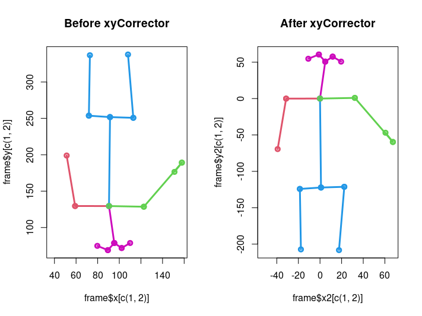
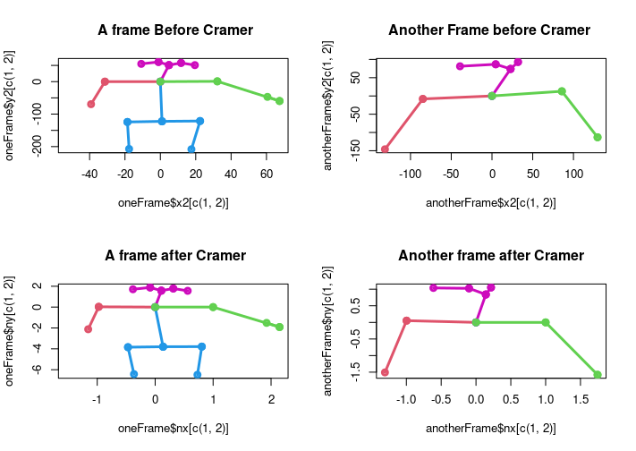

The data generated by `dfMaker` are raw data, i.e. `dfMaker` only structures the data from `OpenPose`, but statistical treatment is needed. Here some functions are presented as a tool to make statistical treatment of `OpenPose` data.

# `fast.mode`

The data structured by `dfMaker` can be in one `CSV` file if it was saved manually, or in several `CSV` files generated by the `save.csv` attribute of `dfMaker`. In the second case, the data has to be loaded and assembled, and the loading time is longer, but sometimes it is better to have a file for a subset instead of a full set.

### Function attributes

fast.mode(fast.mode = `FALSE`, path = "/home/user/filesCSV/")

fast.mode(fast.mode = `TRUE`, path = "/home/user/filesCSV/dataSet.csv")

# `maxPeople`

:notebook: [Example (`R`)](functionsExamples/maxPeopleExample.R)

This function reads `csv` files generated by `dfmaker` and selects data with a maximum number of people detected. It needs to be improved, but for now it is useful to select data where only one person has been detected by `OpenPose`, implying that the speaker is the one doing the gesticulation. The function can read an entire folder or just some videos within the folder if a `csv` file with the names of the desired videos is provided.

### Function attributes

maxPeople(path = "/home/user/dfMakerOutputCSV/", max = 2,full.folder = `TRUE`)

max.people(path = "/home/user/dfMakerOutputCSV/", max = 2,full.folder = `FALSE`, fileNames = "/home/user/selectedFiles.csv")

-   `path`: The raw csv files path generated by `dfMaker`.

-   `max`: The maximum people desired which appear in videos.

-   `full.folder`: Boolean variable (`TRUE`/`FALSE`) to select all files in folder.

-   `fileNames`: In case `full.folder = FALSE` file names must be provided in a `csv` or `txt` file.

**warning!!!** the file names inside `txt` or `csv` file must have the extension `.csv`.

# `clipCleaner`

:notebook: [Example (`R`)](functionsExamples/clipCleanerExample.R)

Sometimes `OpenPose` detects objects as people that are not people. It is hard to find a universal method to remove all wrongly detected points. Here is a method to remove objects where point 1 (chest point) is not detected in any video frame.

The method is simple, but at the moment it only works with 2 people detected, as this is the simplest case. If we have a video where we know that there is a person and his chest appears in the frames, but the software detects another person who is not there, this method is optimal, but for more complex objects a new method has to be developed.

### Function attributes

clipCleaner(data= data, read.path== (TRUE/FALSE), path = "/home/user/dfMakerOutputCSV/",extract.goodCLips = T, save.goodClips.path ="/home/user/selectedCSV/")

| :warning: WARNING                                                                                                                                       |
|:-----------------------------------------------------------------------|
| `selectedCSV/` to create the folder, otherwise (`selectedCSV`) generate files in parent folder. Remmbember always to use `/` at the end of output path. |

-   `data`: In case data is already load in R there is no need for a path.

-   `read.path`:  Boolean variable (`TRUE`/`FALSE`) to read files from folder (`TRUE`) or read a R object already loaded (`FALSE`) .

-   `path`: The raw csv files path generated by `dfMaker`.

-   `extract.goodCLips`: Boolean variable (`TRUE`/`FALSE`) to save or not selected `csv` files in other folder.

-   `goodClips.path`: The path to save selected `csv` files.

### To take in account

- `clipCleaner` automatically removes all face and hands key_points, leaving only the pose_key_points. This can be changed and the idea is to include them in a future version when face and hands points are considered.

- If there is no chest key_point detected in any frame for the second person detected, the video is considered good video, otherwise the function works as `maxPeople` with a fixed parameter to the `max` attribute set to 1 person detected.

# xyCorrector

| :warning: WARNING                                                                                                                                 |
|:-----------------------------------------------------------------------|
| From this point functions are only working for pose_keypoints other systems must be develop for data from `face_keypoints` and `hands_keypoints`. |

:notebook: [Example (`R`)](functionsExamples/xyCorrectorExample.R)

OpenPose videos are based on a two dimensional Cartesian coordinate system and a point (0,0) must be defined, this point can be one of the 25 points in pose_keypoints. The `xyCorrector` allows to select one of the 25 points or their combination, x-axis and y-axis are treated independently, and to set a detected point in the frame as the original point (0,0) and create a standardised reference system.

:bangbang: xyCorrector' creates two new variables, 'x2' and 'y2', which are the corrections to the raw data, but the 'x' and 'y' values are still in the data frame. :bangbang:

 

### Function attributes

xyCorrector(df = example,df.full = T,set.NAs = T,fixed.point.x = 1,fixed.point.y = 1,reverse.y = T,set.x = T ,set.y = T)

-   `df`: An `R` objcet with `data Frame` structure `str(df)`.

-   `df.full`: Boolean variable (`TRUE`/`FALSE`) to remove `face_keypoint` and `hands_keypoints` in case it has not been done yet.

-   `set.Nas`: Boolean variable (`TRUE`/`FALSE`) to turn 0 values into `NA` values. This is need it because zero (0) now it is a real value (axes origin)

-   `reverse.y` : Boolean variable (`TRUE`/`FALSE`) set as `TRUE` by default. It indicates if the y axis must be inverted or not.

-   `set.x = T`and `set.y = T` : Boolean variables (`TRUE`/`FALSE`) set as `TRUE` by default. If they are set as `FALSE` the function does not transform the axe selected. Treatment of axes are independent.

# `cramerOpenPose`

:notebook: [Example (`R`)](functionsExamples/cramerOpenPoseExample.R)

The [Cramer's rule] (https://en.wikipedia.org/wiki/Cramer%27s_rule) allows us to define the units for our system. In the case of our data, the distance between the chest and the left shoulder (in mirror perspective) has a value of 1 and the rest of the distances take new values according to this value.

The aim of `CramerOpenPose` is to apply Cramer's rule to all frames, generating a new value for x e y (`nx`,`ny`) where, regardless of the distance to the camera or the position of the person, even if he/she changes position during the video, the distance between the chest and the left shoulder is 1.

 

| :warning: WARNING                                                                                                                                 |
|:-----------------------------------------------------------------------|
| The person must be looking at the camera, otherwise the distance between the chest and shoulder may be zero, resulting in an indeterminate or inconsistent equation system.    |

### Function attributes

cramerOpenPose(data = example,v.i =5,orthonormal=T,save.video.csv=T,path.save.videos="home/user/cleanDataCSV/" )

* `data` : `R` object with all data from `xyCorrector`. The structure must be `data frame`.

* `v.i` : point from pose_keypoints to create the unit vector for x axe with chest point (0,0). In this case the left shoulder (5).

* `orthonormal`:  Boolean variable (`TRUE`/`FALSE`) to use the same vector (`v.i`) to create the identity matrix.

*  `v.y`: point from pose_keypoints to create the unit vector for y axe with chest point (0,0). Only use when a non-orthogonal system  is desired.

* `save.video.csv`: Boolean variable (`TRUE`/`FALSE`) to save or not normalized data in `csv` files; one file per video.

* `output.folder`: The path to save selected `csv` files.

* `save.parquet`: Boolean variable to save the output in [`.parquet`](https://github.com/apache/parquet-format) format  (`TRUE`/`FALSE`).
