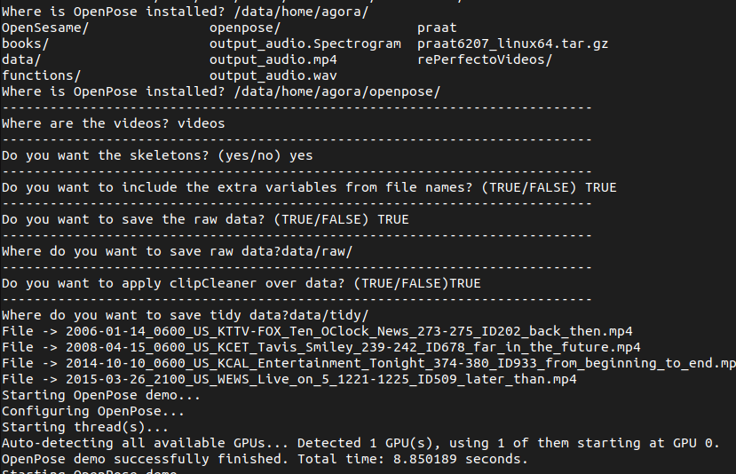

# `postureo.sh`

This bash script allows the users to generate tidy data from videos. Bassicaly, it applies [`OpenPose`](https://github.com/CMU-Perceptual-Computing-Lab/openpose) to videos in .MP4 format  after that it applies the functions describe in this repository to OpenPose output files. 

The script asks some questions at the beginning to choose how and where do you want data.

 

