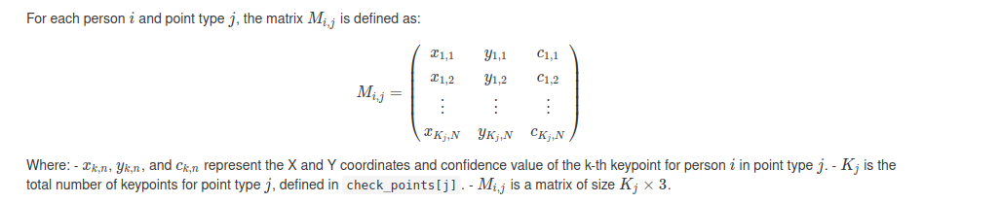

- [Overview](#overview)
- [Technical Requirements](#technical-requirements)
  - [Software and Libraries](#software-and-libraries)
  - [Installation](#installation)
- [Usage](#usage)
  - [Basic Usage](#basic-usage)
  - [Saving to a Specific File](#saving-to-a-specific-file)
  - [In-memory Processing Without Saving](#in-memory-processing-without-saving)
  - [Specifying Output Path](#specifying-output-path)
- [Parameters](#parameters)
- [Configuration File Structure](#configuration-file-structure)
- [Functionality](#functionality)
- [Output](#output)
- [Algebraic Definition of M_{i,j} Matrix](#algebraic-definition-of-m_ij-matrix)
- [Coordinate Normalization and Y-Axis Inversion](#coordinate-normalization-and-y-axis-inversion)
- [Applying Cramer's Rule for Coordinate Transformation](#applying-cramers-rule-for-coordinate-transformation)
- [Collaboration and Contributions](#collaboration-and-contributions)
  - [Reporting Issues or Asking Questions](#reporting-issues-or-asking-questions)


---

# `dfMaker` Function Documentation for OpenPose Data Processing

## Overview

The `dfMaker` function is a comprehensive tool designed for processing and organizing keypoints data generated by [OpenPose](https://github.com/CMU-Perceptual-Computing-Lab/openpose), a cutting-edge tool for real-time multi-person system to detect human body, hand, facial, and foot keypoints. This documentation details the function's usage, input parameters, the configuration file structure, and the algebraic definition of the data structure used for keypoints representation.


## Technical Requirements

To use the `dfMaker` function effectively, you will need the following:

### Software and Libraries
- **R Environment**: Ensure you have R installed on your system. You can download it from [The Comprehensive R Archive Network (CRAN)](https://cran.r-project.org/).
- **R Libraries**:
  - `arrow`: Required for reading JSON files and writing CSV or Parquet files. Install it using `install.packages("arrow")`.

### Installation

Before you can use the `dfMaker` function, you need to install the required R package if you haven't already. You can do this by running the following command in your R environment:

```r
install.packages("arrow")
```

Ensure that all the JSON files output by OpenPose are located in a single directory. This directory will be used as the input for the `input.folder` parameter.

## Usage

Load the `dfMaker` function into your R session:

```r
load("./dfMaker/functionsRData/dfMaker.rda")
```

Below are several examples demonstrating different use cases:

### Basic Usage

Automatically process OpenPose JSON files and save the output with an auto-generated name based on unique IDs:

```r
dfMaker(input.folder = "./path/to/input")
```

### Saving to a Specific File

Process data and explicitly save it as a Parquet file:

```r
dfMaker(input.folder = "./path/to/input",
        output.file = "./path/to/outputs/processed_data.parquet")
```

For CSV output:

```r
dfMaker(input.folder = "./path/to/input",
        output.file = "./path/to/outputs/processed_data.csv")
```

### In-memory Processing Without Saving

Process files for in-memory use without saving to disk:

```r
example <- dfMaker(input.folder = "./path/to/input",
                   no_save = TRUE)
```

### Specifying Output Path

Define an output path for saving the processed file with an automatically generated name:

```r
dfMaker(input.folder = "./path/to/input",
        output.path = "./path/to/custom_output/")
```


### Parameters

- `input.folder`: The directory containing JSON files output by OpenPose. Each file should represent keypoints data for a single frame of video.
- `config.path`: Optional. The path to a JSON configuration file specifying which metadata fields to extract and include in the output. If not provided, default settings are used.
- `output.file`: Optional. Specifies the path and filename for the output file. If provided, the function writes the processed data to this file in either CSV or Parquet format, determined by the file extension. If not provided or empty, and multiple unique IDs are not found, the function automatically names the file based on the unique ID from the OpenPose data.
- `output.path`: Optional. Specifies the directory where the output file will be saved. If `output.file` is not provided or is empty, and there's exactly one unique ID in the processed data, the function automatically creates an output file named after the unique ID within this directory. If `output.path` is not specified, the function will create a default directory `./df_outputs/` to save the output file. This ensures organized storage of output files, especially useful when processing multiple datasets or running batch processes.

### Configuration File Structure

The configuration file is a JSON document that allows users to specify additional metadata to extract from the file names or directory structure. The structure of the configuration file is as follows:

```json
{
  "extract_datetime": false,
  "extract_time": false,
  "extract_exp_search": false,
  "extract_country_code": false,
  "extract_network_code": false,
  "extract_program_name": false,
  "extract_time_range": false,
  "timezone": "America/Los_Angeles"
}
```

Each field in the configuration file is a boolean that indicates whether the corresponding piece of metadata should be extracted. The `timezone` field specifies the timezone for datetime conversion.

## Functionality

`dfMaker` performs the following operations:
- Reads JSON files from `input.folder`, each representing keypoints data for individual frames produced by OpenPose.
- Processes each file according to the configurations specified in `config.path` (if provided).
- Constructs \( M_{i,j} \) matrices for each detected person and point type, organizing keypoints data into a structured format.
- Optionally extracts additional metadata based on file names and the specified configuration.
- Combines all processed data into a single dataframe.
- Outputs the consolidated data to `output.file` in the specified format (CSV or Parquet), automatically naming the file based on unique IDs if required.

## Output

The function returns a dataframe in R, containing the combined keypoints data from all processed frames, along with any extracted metadata. If `output.file` is specified, it also writes this data to a file in the chosen format.

This tool facilitates the detailed analysis of human poses, movements, and interactions, supporting research and development in areas such as motion analysis, computer vision, and interactive systems.


## Algebraic Definition of \( M_{i,j} \) Matrix




## Coordinate Normalization and Y-Axis Inversion

This section explains the process of normalizing keypoints coordinates obtained from computer vision software, ensuring the data aligns with a mathematical coordinate system. Given the nature of computer vision data, where the origin often differs from traditional Cartesian systems, we introduce a method to normalize and adjust the orientation of keypoints data.

### Normalization

Normalization involves scaling the coordinates so that distances between keypoints (e.g., from the chest to the left shoulder) are adjusted to a defined scale. This process utilizes a scaling matrix, \(S = \left(\begin{array}{cc} s_x & 0 \\ 0 & s_x \end{array}\right)\), where \(s_x\) is the scaling factor derived from the distance between specific keypoints.

### Y-Axis Inversion

Due to the nature of image data, where the y-axis might be inverted relative to traditional mathematical orientations, we apply an inversion transformation. This is crucial for aligning the keypoints data with standard coordinate systems used in mathematical and physical models.

The inversion is mathematically represented by the transformation of a vector `v.i`, to `v.j`, where `v.j <- v.i[2:1]*-1`. This operation effectively inverts the y-axis, ensuring that the data representation is consistent with expected mathematical conventions.

This approach ensures that the processed keypoints data is ready for further analysis, modeling, or any other application requiring standardized coordinate systems.


## Applying Cramer's Rule for Coordinate Transformation

Cramer's Rule offers a systematic way to solve systems of linear equations that arise during the normalization and transformation of keypoints coordinates from computer vision outputs. This method is particularly useful for calculating the transformation matrix coefficients when we need to adjust the coordinate system based on keypoints, such as normalizing distances or inverting axes.

### Overview of Cramer's Rule

Cramer's Rule is a theorem in linear algebra that provides the solution to a system of linear equations with as many equations as unknowns, given that the system's matrix determinant is non-zero. It is especially handy for calculating transformations involving scaling and rotation where the equations are linear.

### Transformation Matrix Calculation

To apply Cramer's Rule for our purpose of coordinate normalization and Y-axis inversion, consider a system where the transformations are linear and can be represented by equations relating original keypoints to their transformed counterparts. For a transformation involving normalization based on the distance between specific keypoints (like the chest and shoulder) and inversion of the Y-axis, the system of equations can be represented as follows:

\[ Ax = b \]

Where \(A\) is the matrix of coefficients derived from the original keypoints positions, \(x\) is the vector of variables representing the transformed coordinates, and \(b\) is the vector of outcomes that aligns with the desired transformation.

For a 2D transformation involving scaling and Y-axis inversion, the matrix \(A\) and vector \(b\) can be constructed based on the scaling factor \(s_x\) and the nature of Y-axis inversion. Specifically, \(s_x\) can be determined as \(1/l_{shoulder}\) for normalization, and Y-axis inversion can be applied by adjusting the sign in the transformation equations.

### Example

Given a scaling factor \(s_x\) and a point \(P(x, y)\) to be transformed to \(P'(x', y')\), the equations can be formulated as:

1. \(x' = s_x \cdot x\)
2. \(y' = -s_x \cdot y\)

Using Cramer's Rule, we solve for \(x'\) and \(y'\) by replacing the respective columns in \(A\) with \(b\), calculating the determinants, and then dividing by the determinant of \(A\). This process is repeated for each coordinate to find their new values in the transformed space.

### Integration with Computer Vision Data

When working with keypoints data from computer vision software like OpenPose, this approach allows for precise adjustment of the coordinate system to fit analytical or visualization needs. By applying transformations derived through Cramer's Rule, data scientists and researchers can ensure that their keypoints data is properly scaled and oriented, facilitating more accurate analysis and interpretation of human poses and movements.


## Collaboration and Contributions

Contributions to improve `dfMaker` or extend its functionalities are welcome. To contribute:

1. Fork the repository.
2. Clone your fork and create a new branch for your feature or fix.
3. Make changes and test.
4. Submit a pull request with a comprehensive description of changes.
5. Any technical question: brian.herreno@um.es ;)

### Reporting Issues or Asking Questions

Encounter an issue or have questions? Check the documentation first. If unresolved, open an issue in the repository or reach out to the maintainers directly if contact information is provided.
